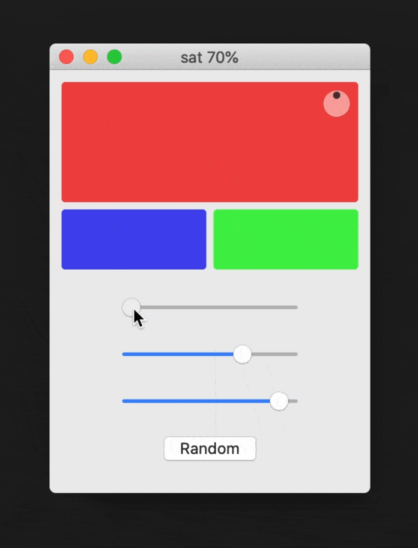

# Colored Demo

A tiny color picker app for macOS, made for education purposes. It enables the user to determine a color of his choice by adjusting a hue, saturation and brightness slider. In addition to his choice the app calculates two additional triadic colors on the fly. Special feature: A randomize-function because why not.

## Used techniques
* UI of the project is based on `Storyboards`
* Code is written in `Swift`
* The fun here lies in the custom `ViewController` class

## Why it’s good for education
* Good exercise on how Xcodes `Interface Builder` works
* Solves the mystery on how code and UI can be “connected” with each other
* Good practice for much of Swift basics like `let`, `var`, `func`, `if`

